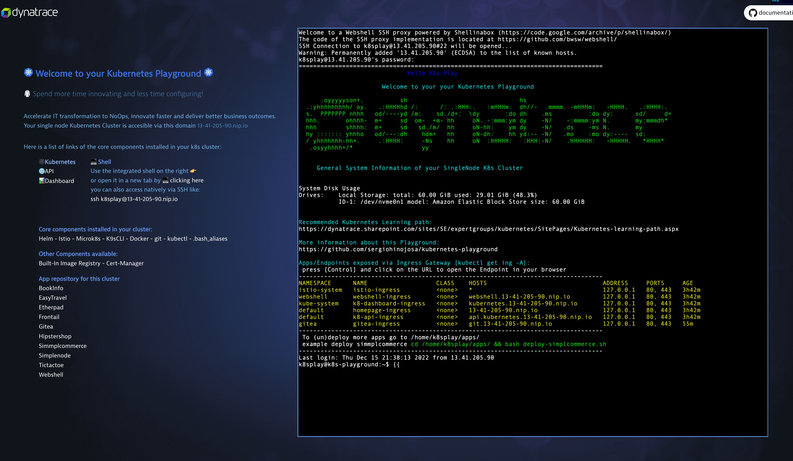

> **DISCLAIMER**: This project is being developed for educational purposes only and is not complete, nor supported. It's publishment is only intended for helping others automate environments for delivering workshops with Kubernetes and/or Dynatrace. Even though the exposed endpoints of this cluster may have valid SSL certificates generated with Cert-Manager and Let's Encrypt, does not mean the Cluster is secure. 

> ## ***🥼⚗ Spend more time innovating and less time configuring***

# Kubernetes Playground

The `Kubernetes Playground` is a single node Kubernetes Cluster based on [microk8s](https://microk8s.io/)  which is a simple production-grade upstream certified Kubernetes made for developers and DevOps.

The mantra behind all this is that you
> Spend **more** time **innovating** 😄⚗️ and *less* time *configuring* 😣🛠

*K8s-Playground is a 🚀 rocket launcher for enabling tutorials or workshops in an easy, fast and resource efficient way.* All tutorials can be automatized and versioned so that the student can at anytime spin the cluster and start exactly with the task at hand so he'll focus on the subject to learn without losing any time configuring trivial stuff.

## Get Started
Most Likely the machine has been provisioned for you. Here are some cool tips and tricks to get you started. The machine has some cool [alias](doc/bash_aliases.md) installed already. Enter into the webshell in the iFrame or open it in a new tab for a better UX. Before starting to type, click on the right mouse to set the colors and settings of the webshell to your pleasing. Once you log in and the settings as you want, you can type the following commands:
- [k9s](https://k9scli.io/) (really cool tool for navigating in kubernetes like butter)
- [kubectl](https://kubernetes.io/docs/reference/kubectl/) (comes with autocomplete)
- [docker](https://www.docker.com/) (for building your own images and installing them in the private regitry of your cluster)
- [istioctl](https://istio.io/latest/docs/reference/commands/istioctl/) 
- [helm](https://helm.sh/) (for installing any other app in seconds)
- [alias](/doc/bash_aliases.md)

for deploying apps, just go to `cd ~/k8s-play/apps` and enter the folder of the app you want to deploy. Inside the folder you'll find a script for deploying and undeploying. It should be self-explanatory. The shell is normally for helping generate the Ingress rule with a subdomain so the app can be exposed with the help of one IP and a magic domain ([nip.io](https://nip.io))

## Verify the installation
By default the installation log can be found under `/tmp/k8splay-install.log`
Type `less +F /tmp/k8splay-install.log` to read the log, scroll forward, and keep trying to read when the end of file is reached (in case the installation is still running).

## Monitoring with Dynatrace

By default your instance will be monitored with the Dynatrace credentials you provisioned (`tenant`, `api_token`, `data_ingest_token`) which are required when you monitor a [Kubernetes Cluster with Dynatrace](https://www.dynatrace.com/support/help/setup-and-configuration/setup-on-container-platforms/kubernetes/get-started-with-kubernetes-monitoring). 

The default deployment mode is [Classic full-stack injection](dynatrace.com/support/help/setup-and-configuration/setup-on-container-platforms/kubernetes/get-started-with-kubernetes-monitoring/deployment-options-k8s#classic) but you can easily swap to the [CloudNative full-stack injection](https://www.dynatrace.com/support/help/setup-and-configuration/setup-on-container-platforms/kubernetes/get-started-with-kubernetes-monitoring/deployment-options-k8s#cloud-native), (yeah, how cool is that!?). [Go here to learn more](cluster-setup/resources/dynatrace).

<!--  

TODO Set the installation
- tenant and tokens when provisioning
- where are the credentials saved
- how to deploy and undeploy
- how to swap
-->

## Deploy your app with just OneClick 🚀!

The following apps can be found under the [apps](apps) folder. Inside each app there is one bash script for deploying the app and one for removing it. When provisioning the machine this repo will be cloned as `k8s-play`in the home directory like: `~/k8s-play`

<table style="table-layout: fixed; width: 100%; text-align: center;" >
<tr valign="top">
  <td style="width:25%;"><a href="apps/bookinfo" target="_blank">BookInfo</a></td>
  <td style="width:25%;"><a href="apps/easytravel-k8s" target="_blank">EasyTravel</a></td>
  <td style="width:25%;"><a href="apps/etherpad" target="_blank">Etherpad</a></td>
  <td style="width:25%;"><a href="apps/frontail" target="_blank">Frontail</a></td>
</tr>
<tr valign="top">
  <td style="width:25%;"><a href="apps/gitea" target="_blank">Gitea</a></td>
  <td style="width:25%;"><a href="apps/hipstershop" target="_blank">Hipstershop</a></td>
  <td style="width:25%;"><a href="apps/simplcommerce" target="_blank">Simplcommerce</a></td>
  <td style="width:25%;"><a href="apps/simplenode" target="_blank">Simplenode</a></td>
</tr>
<tr valign="top">
  <td style="width:25%;"><a href="apps/tictactoe" target="_blank">TicTacToe</a></td>
  <td style="width:25%;"><a href="apps/webshell" target="_blank">Webshell</a></td>
  <td style="width:25%;"></td>
  <td style="width:25%;"></td>
</tr>

## Provisioning your own Kubernetes Playground
