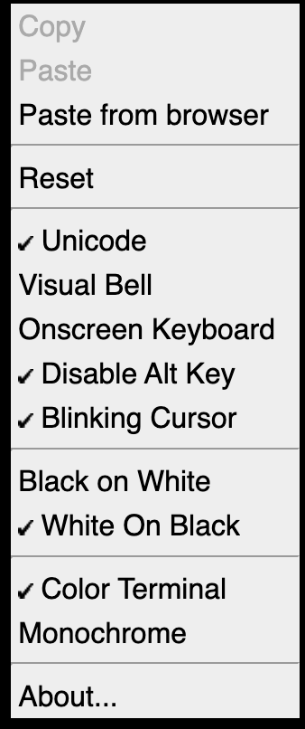

# Webshell

## Deploy & Undeploy the application
How to deploy
`bash deploy-webshell.sh`

How to remove
`bash remove-webshell.sh`

## Official Documentation

https://github.com/bwsw/webshell/

## How to connect to the Kubernetes Cluster via Webshell

The Webshell is exposed via an Ingress like: https://webshell.192-168-0-10.nip.io. 

## Right mouse options

## Accessing directly via Parameters
If you enter the Webshell app you'll have to enter the server, port and user to be able to connect to the secure shell. Now with parameters ? is possible to automate the entry to the own server like: 

lets say the cluster ip is: 192.168.0.10 and the user is `k8splay` then with the help of a magic domain (nip.io) an ingress and parameters is possible to connect with one URL like:
> https://webshell.192-168-0-10.nip.io/?192.168.0.10/22/k8splay